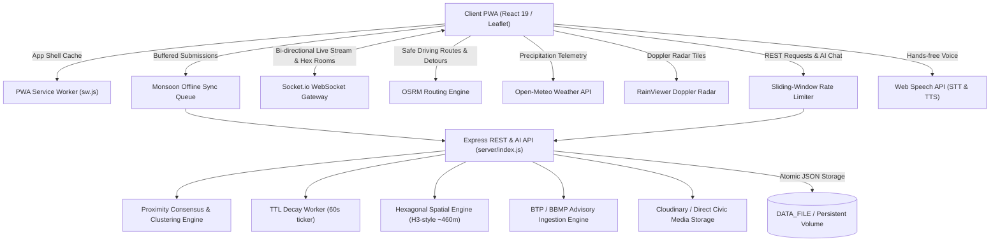

# 🛰️ NammaDrishti — Bengaluru Real-Time Civic & Transit Radar

> High-accuracy, hyper-localized, real-time civic sensing, Doppler rain radar, underpass inundation monitoring, spatial auto-clustering, proximity consensus, automated flood rerouting, and emergency SOS dispatch for Bengaluru commuters.

[](https://github.com/Vedant817/NammaDrishti/actions)
[](LICENSE)

---

## 🌟 Overview

**NammaDrishti** (ನಮ್ಮ ದೃಷ್ಟಿ — *Our Vision / Radar*) is a production-grade civic intelligence and transit surveillance platform engineered specifically for Bengaluru's complex urban infrastructure. It bridges the critical information gap during severe monsoons, flash floods, chronic traffic bottlenecks, and civic emergencies by synthesizing:

1. **Spatial Auto-Clustering (200m / 60-min window)**: When multiple citizens report hazards of the same type within 200 meters of an active report, NammaDrishti automatically merges them into a single consolidated hazard cluster with appended commentary, preventing pin clutter.
2. **Hexagonal Spatial Partitioning & Rooms**: Discrete hexagonal cell indexing (Resolution 8 ~460m) mapping coordinates to discrete spatial rooms with neighbor ring queries (`/api/incidents/hex/:hexId`), enabling targeted WebSocket room broadcasts.
3. **Proximity-Weighted Multi-Peer Consensus**: High-integrity validation where on-ground commuters ($\le 1.5$ km) receive full 1.0x confirmation weight, while remote observations receive 0.25x weight. Incidents require 2 independent citizen confirmations to clear from the live map.
4. **Anti-Sybil Clearance & Authoritative Sanitization**: Prevents duplicate voting from the same client fingerprint on incident verification and clearance. Strips unauthorized claims of official titles (BTP, BBMP) on citizen-submitted incidents.
5. **Time-To-Live (TTL) Dynamic Hazard Decay**: Category-based half-life decay worker (Traffic: 4h, Waterlogging: 12h, Accident: 6h, Infrastructure: 48h) with high-consensus grace multipliers that automatically purges stale hazards.
6. **Sliding-Window IP Rate Limiting**: In-memory rate limiting across incident reporting, verification votes, media uploads, and AI chat queries to prevent bot spam and denial of service.
7. **BTP & BBMP Official Advisory Ingestion**: Background integration worker ingesting authoritative alerts from Bengaluru Traffic Police and BBMP Disaster Management (metro construction diversions, pipeline repairs, emergency road closures).
8. **Civic Media CDN & Direct Storage Pipeline**: Secure image upload endpoint (`/api/media/upload`) with SHA-256 deduplication hashing, MIME sanitization, and automatic delegation to Cloudinary CDN when configured.
9. **Citizen Reputation & Gamification Tiers**: Dynamic civic karma scoring with recognition badges (`Bengaluru Scout`, `Ward Sentinel`, and `City Guardian`) rewarding active contributors.
10. **Voice-Enabled AI Transit Assistant**: Intelligent contextual assistant querying active incidents, flood risks, and emergency helplines with Web Speech Recognition (voice-to-text) and hands-free text-to-speech (`window.speechSynthesis`).
11. **Automated Flood & Hazard Rerouting**: Smart routing engine detecting inundated underpasses and gridlocked corridors within 450m of travel paths, automatically computing dynamic detours around hazard zones.
12. **Monsoon Offline Sync Queue**: Background sync queue that buffers citizen reports during mobile packet loss or network dropouts, automatically draining and broadcasting them once cellular connectivity recovers.
13. **One-Tap Bengaluru Emergency SOS Dispatch**: Instant emergency location capture, one-tap dialing to National Emergency (112) and BTP (1095), and pre-populated WhatsApp SOS dispatch with precise Google Maps coordinates.
14. **Spatial Risk Heatmap / Density Layer**: Real-time weighted visual density clusters highlighting acute hazard concentration zones across Bengaluru's arterial corridors.
15. **Real-Time Doppler Rain Radar**: Live 5-minute automated updates from RainViewer radar frames projected directly over Bengaluru's municipal wards.
16. **Open-Meteo Precision Weather & Flood Telemetry**: Hourly precipitation intensity, relative humidity, wind vectors, and dynamic flood risk indexing with fail-safe offline state reporting.
17. **Chronic Underpass Inundation Watch**: Pre-calibrated spatial catalog of Bengaluru's most critical waterlogging bottlenecks (K.R. Circle, Panathur Railway Underpass, Windsor Manor, Okalipuram, Benniganahalli, Marathahalli) with real-time precipitation trigger thresholds.
18. **2.5 km Proximity Geofencing & Web Audio Alerts**: Browser-based geolocation alerts paired with a gentle dual-tone Web Audio chime that warns drivers when approaching active flooded roads or accidents.
19. **Trilingual Localization**: Full native UI support for **Kannada (ಕನ್ನಡ)**, **Hindi (हिंदी)**, and **English**.
20. **Production Single-Container Deployment**: Built-in production SPA static file serving in Express with wildcard client routing and customizable persistent storage (`DATA_FILE`).

---

## 🏗️ System Architecture



---

## 📡 REST API Reference

| Method | Endpoint | Description | Rate Limit |
|---|---|---|:---:|
| `GET` | `/api/health` | Service health, uptime, active incidents, and feature flags | Unlimited |
| `GET` | `/api/incidents` | Query active incidents with optional `type`, `urgency`, `ward`, and `hex` filters | Unlimited |
| `POST` | `/api/incidents` | Report a new hazard (auto-clusters if within 200m of active incident) | 10 / min |
| `POST` | `/api/incidents/:id/verify` | Weighted verification (1.0x on-ground $\le 1.5$ km, 0.25x remote) | 30 / min |
| `POST` | `/api/incidents/:id/resolve` | Multi-citizen hazard clearance (requires 2 confirmations) | Unlimited |
| `GET` | `/api/incidents/hex/:hexId` | Query incidents within a hex cell and its neighboring rings | Unlimited |
| `GET` | `/api/incidents/spatial/neighborhood` | Query hex neighborhood from GPS `lat` and `lng` | Unlimited |
| `GET` | `/api/advisories/btp` | Ingested official Bengaluru Traffic Police & BBMP advisories | Unlimited |
| `POST` | `/api/advisories/sync` | Trigger on-demand sync of official police advisories | Unlimited |
| `POST` | `/api/assistant/chat` | Conversational transit assistant querying live city incidents | 20 / min |
| `POST` | `/api/media/upload` | Upload civic photo evidence with SHA-256 hash | 15 / min |
| `GET` | `/api/media/status` | Current media storage provider (Cloudinary vs Direct Storage) | Unlimited |

---

## 🚀 Getting Started

### Prerequisites
- **Node.js**: v18.0.0 or higher
- **npm**: v9.0.0 or higher
- **Docker & Docker Compose** (optional, for containerized run)

### Local Development

1. **Clone the repository**:
   ```bash
   git clone https://github.com/Vedant817/NammaDrishti.git
   cd NammaDrishti
   ```

2. **Install dependencies**:
   ```bash
   # Install root frontend dependencies
   npm install --legacy-peer-deps

   # Install server backend dependencies
   cd server && npm install && cd ..
   ```

3. **Start both Frontend and Backend concurrently**:
   ```bash
   # Terminal 1: Start Express & WebSocket Server (Port 5001)
   npm run server

   # Terminal 2: Start React Development Server (Port 3000)
   npm start
   ```

4. Open your browser and navigate to `http://localhost:3000`.

---

## 🧪 Testing & Quality Assurance

NammaDrishti includes a unified multi-tier test suite with zero external mocks required:

```bash
# Run complete test suite (Frontend + Backend + E2E + Sandbox Scenarios)
npm run test:all

# Run frontend tests only (React Testing Library - 7 test suites)
npm run test:ci

# Run backend API, clustering, proximity, and TTL tests (13 test cases)
npm run test:backend

# Run heavy user commuter journey simulation (11 workflows)
npm run test:e2e

# Run isolated simulation sandbox (8 end-to-end multi-commuter scenarios)
npm run test:sandbox
```

### 🔬 Isolated Simulation Sandbox Scenarios

The isolated sandbox runner (`scripts/sandbox_scenario_runner.js`) spins up an ephemeral backend server on a dedicated isolated port with isolated temporary disk storage, systematically executing 8 real-life commuter scenarios:
1. **Monsoon Flash Flood & Proximity Consensus**: Citizen reports ORR EcoSpace flash flood; on-ground commuters confirm with 1.0x weight; anti-Sybil protection rejects duplicate votes with HTTP 409 Conflict.
2. **Spatial Hazard Auto-Clustering**: Nearby hazard reports within 200m auto-merge into existing corridor clusters without duplicating map pins.
3. **Safe Navigation Corridor & Dynamic Rerouting**: Real-time corridor conflict detector alerts of flood intersections on primary route and generates a zero-conflict safe detour.
4. **Monsoon Offline Queue Sync**: Simulates network disconnection during cloudbursts, queues reports locally, and drains + syncs with WebSocket broadcast once reconnected.
5. **Multi-Citizen Clearance Consensus**: Requires 2 unique citizen confirmations to mark resolved and purge from live map; enforces Sybil immunity.
6. **Dynamic TTL Decay & Worker Lifecycle**: Expired incidents past their half-life are safely purged with atomic disk persistence.
7. **Context-Aware AI Commute Assistant**: Inquires on Panathur flood status, Silk Board/HSR congestion, and Doppler rain telemetry with 96% confidence score.
8. **One-Tap Emergency SOS Dispatch**: Formats stranded commuter coordinates into instant 112/1095 hotline targets and pre-formatted WhatsApp SOS dispatch links.

### Production Build

```bash
npm run build
```

---

## 🐳 Docker Deployment

Run the complete multi-stage containerized stack with a single command:

```bash
docker-compose up --build
```
The application will be live at `http://localhost:5001`, serving both the static React SPA and real-time backend API from a unified container with persistent data storage.

---

## 📄 License
MIT © Vedant817
