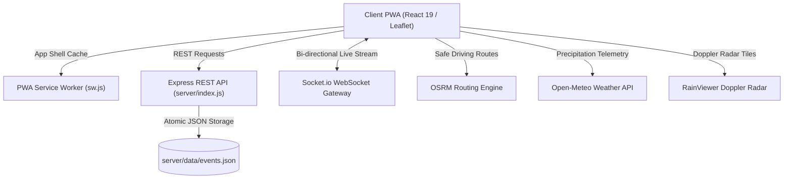

# 🛰️ NammaPulse — Bengaluru Real-Time Civic & Transit Intelligence

> High-accuracy, hyper-localized, real-time civic incident tracking, Doppler rain radar, underpass inundation monitoring, and safe hazard-avoidance routing for Bengaluru commuters.

---

## 🌟 Overview

**NammaPulse** (ನಮ್ಮ ಪಲ್ಸ್) is a production-grade civic intelligence web application engineered specifically for Bengaluru's urban infrastructure challenges. It bridges the critical information gap during severe monsoons, flash floods, chronic traffic bottlenecks, and civic emergencies by synthesizing:

1. **Live Citizen Crowdsourcing & Multi-Peer Consensus**: High-integrity incident reporting with client-side image compression, spatial deduplication, and a multi-citizen consensus mechanism (requiring independent confirmations before clearance) to prevent manipulation.
2. **Real-Time Doppler Rain Radar**: Live 5-minute automated updates from RainViewer radar frames projected directly over Bengaluru's municipal wards.
3. **Open-Meteo Precision Weather & Flood Telemetry**: Hourly precipitation intensity, relative humidity, wind vectors, and dynamic flood risk indexing with fail-safe offline state reporting.
4. **Chronic Underpass Inundation Watch**: Pre-calibrated spatial catalog of Bengaluru's most critical waterlogging bottlenecks (K.R. Circle, Panathur Railway Underpass, Windsor Manor, Okalipuram, Benniganahalli, Marathahalli) with real-time precipitation trigger thresholds.
5. **Safe Navigation Corridor Routing**: OSRM-powered route calculation augmented with perpendicular point-to-segment distance spatial algorithms (`distanceToSegmentKm`) that flag hazards located along road segments between navigation waypoints.
6. **2.5 km Proximity Geofencing & Web Audio Alerts**: Browser-based geolocation alerts paired with a gentle dual-tone Web Audio chime that warns drivers when approaching active flooded roads or accidents.
7. **Trilingual Localization**: Full native UI support for **Kannada (ಕನ್ನಡ)**, **Hindi (हिंदी)**, and **English**.
8. **Monsoon-Resilient Offline PWA**: Service Worker caching of App Shell assets ensuring uninterrupted access during severe weather-induced mobile packet loss and cell tower degradation.

---

## 🏗️ System Architecture



---

## 🚀 Getting Started

### Prerequisites
- **Node.js**: v18.0.0 or higher
- **npm**: v9.0.0 or higher

### Local Development

1. **Clone the repository**:
   ```bash
   git clone https://github.com/Vedant817/NammaPulse.git
   cd NammaPulse
   ```

2. **Install dependencies**:
   ```bash
   # Install root frontend dependencies
   npm install

   # Install server backend dependencies
   cd server && npm install && cd ..
   ```

3. **Start both Frontend and Backend concurrently**:
   ```bash
   # Terminal 1: Start Express & WebSocket Server (Port 5001)
   npm run server

   # Terminal 2: Start React Development Server (Port 3000)
   npm start
   ```

4. Open your browser and navigate to `http://localhost:3000`.

---

## 🧪 Testing & Quality Assurance

NammaPulse includes unified frontend and backend test suites with zero external mocks required:

```bash
# Run complete test suite (Frontend + Backend)
npm run test:all

# Run frontend tests only
npm run test:ci

# Run backend API & consensus tests only
npm run test:backend
```

### Production Build

```bash
npm run build
```

---

## 🐳 Docker & Containerization

Deploy NammaPulse anywhere with Docker and Docker Compose:

```bash
# Build and run containerized NammaPulse stack
docker-compose up --build -d

# View container logs
docker-compose logs -f

# Verify container health check
docker inspect --format='{{json .State.Health}}' nammapulse-app
```

The application will be accessible at `http://localhost:5001`.

---

## 🛡️ Reliability & Security Highlights

- **Consensus Clearance**: Requires 2 independent citizen confirmations to clear an incident, preventing premature removal of active hazards.
- **Vote Fraud Prevention**: Tracks user action tokens (`nammapulse_user_votes_v1`) to prevent click-farming and manufactured consensus.
- **Storage Quota Protection**: Client-side `safeSaveStorage` catches `QuotaExceededError` and downsamples base64 images from older entries, guaranteeing incident titles and coordinates are never lost.
- **Atomic Server Persistence**: Uses synchronous atomic disk writes with memory rollbacks if disk errors occur.
- **Perpendicular Spatial Distance**: Employs mathematical line-segment projection to avoid missing road hazards situated along straight highway stretches between OSRM vertices.

---

## 🗺️ Monitored Transit Corridors & Underpass Basins

| Underpass / Corridor | Zone | Critical Rain Threshold | Recorded Max Inundation | Drainage Infrastructure |
| :--- | :--- | :--- | :--- | :--- |
| **K.R. Circle Underpass** | Central / Vidhana Soudha | 8.0 mm/hr | 5.5 ft | Dual Submersible 15HP + Automated Barrier |
| **Panathur Railway Underpass** | Mahadevapura / ORR | 6.0 mm/hr | 4.2 ft | Single Diesel Pump + Manual Barricade |
| **Windsor Manor Underpass** | West / Sankey | 10.0 mm/hr | 3.5 ft | Dual Electric 20HP + Visual Gauge |
| **Okalipuram Underpass** | Majestic / West | 9.0 mm/hr | 4.0 ft | Fixed Sump 10HP + Manual Barrier |
| **Benniganahalli Bridge** | East / KR Puram | 7.5 mm/hr | 4.8 ft | Dual Sump + Police Caution Board |
| **Silk Board - BTM Corridor** | South / Central Silk Board | Historical Chokepoint | Baseline Delay +28 min | Monitored Transit Corridor |

---

## 📄 License

MIT © 2026 Vedant817
