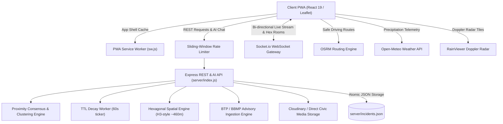

# 🛰️ NammaPulse — Bengaluru Real-Time Civic & Transit Intelligence

> High-accuracy, hyper-localized, real-time civic incident tracking, Doppler rain radar, underpass inundation monitoring, spatial auto-clustering, proximity consensus, and safe hazard-avoidance routing for Bengaluru commuters.

---

## 🌟 Overview

**NammaPulse** (ನಮ್ಮ ಪಲ್ಸ್) is a production-grade civic intelligence web application engineered specifically for Bengaluru's urban infrastructure challenges. It bridges the critical information gap during severe monsoons, flash floods, chronic traffic bottlenecks, and civic emergencies by synthesizing:

1. **Spatial Auto-Clustering (200m / 60-min window)**: When multiple citizens report hazards of the same type within 200 meters of an active report, NammaPulse automatically merges them into a single consolidated hazard cluster with appended commentary, preventing pin clutter.
2. **Hexagonal Spatial Partitioning & Rooms**: Discrete hexagonal cell indexing (Resolution 8 ~460m) mapping coordinates to discrete spatial rooms with neighbor ring queries (`/api/incidents/hex/:hexId`), enabling targeted WebSocket room broadcasts.
3. **Proximity-Weighted Multi-Peer Consensus**: High-integrity validation where on-ground commuters ($\le 1.5$ km) receive full 1.0x confirmation weight, while remote observations receive 0.25x weight. Incidents require 2 independent citizen confirmations to clear from the live map.
4. **Time-To-Live (TTL) Dynamic Hazard Decay**: Category-based half-life decay worker (Accidents: 2h, Waterlogging: 4h, Traffic: 3h, Infrastructure: 72h) that automatically retires stale hazards.
5. **Sliding-Window IP Rate Limiting**: In-memory rate limiting across incident reporting, verification votes, media uploads, and AI chat queries to prevent bot spam and denial of service.
6. **BTP & BBMP Official Advisory Ingestion**: Background integration worker ingesting authoritative alerts from Bengaluru Traffic Police and BBMP Disaster Management (metro construction diversions, pipeline repairs, emergency road closures).
7. **Civic Media CDN & Direct Storage Pipeline**: Secure image upload endpoint (`/api/media/upload`) with SHA-256 deduplication hashing, MIME sanitization, and automatic delegation to Cloudinary CDN when configured.
8. **Citizen Reputation & Gamification Tiers**: Dynamic civic karma scoring with recognition badges (`Bengaluru Scout`, `Ward Sentinel`, and `City Guardian`) rewarding active contributors.
9. **Conversational AI Transit Assistant**: Intelligent contextual assistant querying active incidents, flood risks, and emergency helplines with fast server-side and client-side fail-safe fallbacks.
10. **Real-Time Doppler Rain Radar**: Live 5-minute automated updates from RainViewer radar frames projected directly over Bengaluru's municipal wards.
11. **Open-Meteo Precision Weather & Flood Telemetry**: Hourly precipitation intensity, relative humidity, wind vectors, and dynamic flood risk indexing with fail-safe offline state reporting.
12. **Chronic Underpass Inundation Watch**: Pre-calibrated spatial catalog of Bengaluru's most critical waterlogging bottlenecks (K.R. Circle, Panathur Railway Underpass, Windsor Manor, Okalipuram, Benniganahalli, Marathahalli) with real-time precipitation trigger thresholds.
13. **Safe Navigation Corridor Routing**: OSRM-powered route calculation augmented with perpendicular point-to-segment distance spatial algorithms (`distanceToSegmentKm`) that flag hazards located along road segments between navigation waypoints.
14. **2.5 km Proximity Geofencing & Web Audio Alerts**: Browser-based geolocation alerts paired with a gentle dual-tone Web Audio chime that warns drivers when approaching active flooded roads or accidents.
15. **Trilingual Localization**: Full native UI support for **Kannada (ಕನ್ನಡ)**, **Hindi (हिंदी)**, and **English**.
16. **Monsoon-Resilient Offline PWA**: Service Worker caching of App Shell assets ensuring uninterrupted access during severe weather-induced mobile packet loss and cell tower degradation.

---

## 🏗️ System Architecture



---

## 📡 REST API Reference

| Method | Endpoint | Description | Rate Limit |
|---|---|---|:---:|
| `GET` | `/api/health` | Service health, uptime, active incidents, and feature flags | Unlimited |
| `GET` | `/api/incidents` | Query active incidents with optional `type` and `urgency` filters | Unlimited |
| `POST` | `/api/incidents` | Report a new hazard (auto-clusters if within 200m of active incident) | 20 / min |
| `POST` | `/api/incidents/:id/verify` | Weighted verification (1.0x on-ground $\le 1.5$ km, 0.25x remote) | 40 / min |
| `POST` | `/api/incidents/:id/resolve` | Multi-citizen hazard clearance (requires 2 confirmations) | Unlimited |
| `GET` | `/api/incidents/hex/:hexId` | Query incidents within a hex cell and its 6 neighboring rings | Unlimited |
| `GET` | `/api/advisories/btp` | Ingested official Bengaluru Traffic Police & BBMP advisories | Unlimited |
| `POST` | `/api/advisories/sync` | Trigger on-demand sync of official police advisories | Unlimited |
| `POST` | `/api/assistant/chat` | Conversational transit assistant querying live city incidents | 30 / min |
| `POST` | `/api/media/upload` | Upload civic photo evidence with SHA-256 hash | 15 / min |
| `GET` | `/api/media/status` | Current media storage provider (Cloudinary vs Direct Storage) | Unlimited |

---

## 🚀 Getting Started

### Prerequisites
- **Node.js**: v18.0.0 or higher
- **npm**: v9.0.0 or higher

### Local Development

1. **Clone the repository**:
   ```bash
   git clone https://github.com/Vedant817/NammaPulse.git
   cd NammaPulse
   ```

2. **Install dependencies**:
   ```bash
   # Install root frontend dependencies
   npm install --legacy-peer-deps

   # Install server backend dependencies
   cd server && npm install && cd ..
   ```

3. **Start both Frontend and Backend concurrently**:
   ```bash
   # Terminal 1: Start Express & WebSocket Server (Port 5001)
   npm run server

   # Terminal 2: Start React Development Server (Port 3000)
   npm start
   ```

4. Open your browser and navigate to `http://localhost:3000`.

---

## 🧪 Testing & Quality Assurance

NammaPulse includes a unified multi-tier test suite with zero external mocks required:

```bash
# Run complete test suite (Frontend + Backend + Commuter E2E Simulation)
npm run test:all

# Run frontend tests only (React Testing Library)
npm run test:ci

# Run backend API, clustering, proximity, and TTL tests (12 test cases)
npm run test:backend

# Run heavy user commuter journey simulation (14 workflows)
npm run test:e2e
```

### Production Build

```bash
npm run build
```

---

## 🐳 Docker Deployment

Run the complete multi-stage containerized stack with a single command:

```bash
docker-compose up --build
```
The application will be live at `http://localhost:5001`.

---

## 📄 License
MIT © Vedant817
